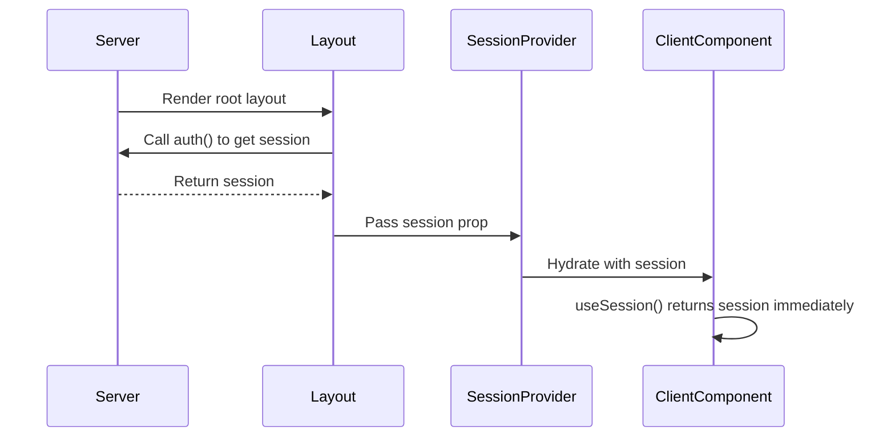

# Auth Session Provider Fix

## Problem

Users were logged in but the dashboard view (home page at `/`) still didn't detect they were logged in. The login banner was showing even after successful authentication.

## Root Cause

The `SessionProvider` from `next-auth/react` was not receiving the initial session from the server. In Next.js App Router with NextAuth v5, the session needs to be:

1. Fetched on the server using `auth()`
2. Passed to the client-side `SessionProvider` via props

Without this, the `SessionProvider` has to fetch the session client-side after hydration, which can cause:
- Flash of unauthenticated content
- `useSession()` returning `null` initially even when user is logged in
- Inconsistent auth state between server and client

## Solution

### 1. Updated Root Layout (`web/src/app/layout.tsx`)

Made the layout async and fetch the session server-side:

```typescript
import { auth } from "~/server/auth";

export default async function RootLayout({
  children,
}: {
  children: React.ReactNode;
}) {
  const session = await auth(); // Fetch session on server
  
  return (
    <html lang="en" className={fontSans.variable} suppressHydrationWarning>
      <body className={cn("min-h-screen bg-background font-sans antialiased")}>
        <NextAuthProvider session={session}> {/* Pass session to provider */}
          {/* ... rest of layout */}
        </NextAuthProvider>
      </body>
    </html>
  );
}
```

### 2. Updated NextAuthProvider (`web/src/app/next-auth-provider.tsx`)

Added session prop to pass server session to `SessionProvider`:

```typescript
"use client";

import { SessionProvider } from "next-auth/react";
import { type Session } from "next-auth";

type Props = {
  children?: React.ReactNode;
  session?: Session | null;
};

export const NextAuthProvider = ({ children, session }: Props) => {
  return <SessionProvider session={session}>{children}</SessionProvider>;
};
```

### 3. Created Debug Endpoint (`web/src/app/api/debug-session/route.ts`)

Added a debug endpoint at `/api/debug-session` to help diagnose session issues:

```typescript
export async function GET(request: NextRequest) {
  const session = await auth();
  const token = await getToken({ req: request, secret: process.env.NEXTAUTH_SECRET });
  const cookieStore = cookies();
  
  return NextResponse.json({
    hasSession: !!session,
    hasToken: !!token,
    hasSub: !!token?.sub,
    // ... more debug info
  });
}
```

## What This Fixes

1. **Immediate Session Detection**: `useSession()` now has the session data immediately on first render
2. **No Flash of Unauthenticated Content**: The session is hydrated from server, no client-side fetch needed
3. **Consistent Auth State**: Server and client now have the same session state from the start
4. **Login Banner**: The login banner on the home page now correctly hides when user is logged in

## How Auth Flow Works Now



## Testing

1. Sign in to the application
2. Navigate to home page (`/`)
3. **Expected**: Login banner should NOT appear
4. **Expected**: Dashboard and portfolio links should appear in header
5. Visit `/api/debug-session` to verify:
   - `hasSession: true`
   - `hasSub: true`
   - `hasToken: true`

## Files Modified

- `web/src/app/layout.tsx` - Made async, fetch session, pass to provider
- `web/src/app/next-auth-provider.tsx` - Accept session prop
- `web/src/app/api/debug-session/route.ts` - New debug endpoint (can be removed later)

## Additional Notes

- This is the recommended pattern for NextAuth v5 with App Router
- The layout is now dynamic (not static), but this is necessary for per-request auth
- Session is still using JWT strategy for performance
- No breaking changes to existing auth configuration

