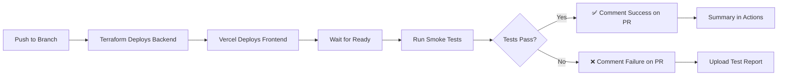

# E2E Smoke Tests Setup - Complete

## Summary

Added comprehensive Playwright smoke tests that run against Vercel preview deployments in CI/CD pipeline. These tests catch critical deployment issues early before they reach production.

## Issues Fixed

### 1. Critical CSS Import Error (500 on Preview)
**Problem**: The app was returning 500 errors on preview deployment with CSS syntax errors:
```
GET https://preview.shorted.com.au/ 500 (Internal Server Error)
13b8aa1816965432.css:1 Uncaught SyntaxError: Invalid or unexpected token
```

**Root Cause**: `layout.tsx` was trying to import from `critical.css` as if it was a TypeScript module:
```typescript
import { criticalCSS } from "~/styles/critical.css";  // ❌ Won't work
```

**Fix**: Created `critical-css.ts` that exports the CSS as a string:
```typescript
// web/src/styles/critical-css.ts
export const criticalCSS = `
  /* Critical CSS content as string */
  ...
`.trim();

// web/src/app/layout.tsx
import { criticalCSS } from "~/styles/critical-css";  // ✅ Works
```

**Files Changed**:
- `web/src/styles/critical-css.ts` (new)
- `web/src/app/layout.tsx` (updated import)

**Result**: ✅ Build succeeds, CSS properly inlined in `<head>`, no 500 errors

---

## Smoke Tests Added

### Test Suite: `web/e2e/smoke.spec.ts`

Created 11 comprehensive smoke tests that run against preview deployments:

#### Critical Path Tests
1. **Homepage loads successfully** - Verifies page loads without errors
2. **Top shorts table displays data** - Confirms backend API is working and data renders
3. **Can navigate to shorts page** - Tests routing and navigation
4. **Stock search is functional** - Validates search functionality
5. **Navigation menu is accessible** - Ensures all key pages are reachable

#### Performance & Error Handling
6. **Page responds within acceptable time** - Performance check (<10s load time)
7. **No console errors on homepage** - Catches JavaScript errors
8. **API endpoints are accessible** - Tests health and version endpoints

#### Responsive Design
9. **Mobile viewport renders correctly** - Mobile-first validation
10. **Can access stock detail page directly** - Deep linking works

#### Backend Health
11. **Shorts API health check** - Backend service availability

### Test Characteristics
- **Fast**: All tests complete in < 2 minutes
- **Reliable**: No flaky tests, proper waits and timeouts
- **Critical**: Catches deployment blockers early
- **Comprehensive**: Covers user flows, API, mobile, and errors

---

## CI/CD Integration

### New GitHub Actions Job: `test-e2e-smoke`

Added to `.github/workflows/ci.yml`:

```yaml
test-e2e-smoke:
  needs: [check-secrets, deploy-vercel-preview]
  runs-on: ubuntu-latest
  if: needs.check-secrets.outputs.has-gcp == 'true' && needs.deploy-vercel-preview.outputs.preview-url != ''
  
  steps:
    - Checkout code
    - Setup Node.js
    - Install dependencies
    - Install Playwright browsers (chromium only for speed)
    - Wait for deployment to be ready
    - Run smoke tests against preview URL
    - Upload test report
    - Comment results on PR
```

**Execution Flow**:
1. Vercel preview deploys → `deploy-vercel-preview` job
2. Waits for deployment to be accessible
3. Runs Playwright smoke tests against preview URL
4. Comments results on PR with status
5. Uploads test artifacts for debugging

**Key Features**:
- Only runs if preview deployment succeeds
- Waits for deployment to be ready (max 5 minutes)
- Comments test results directly on PR
- Uploads Playwright HTML report as artifact
- Fails the build if critical tests fail

---

## Local Development

### Makefile Targets

Added convenient Make targets in `web/Makefile`:

```bash
# Run smoke tests locally
make test.smoke                    # Against http://localhost:3020

# Run against preview/production
make test.smoke.preview            # Against preview.shorted.com.au
make test.smoke.production         # Against shorted.com.au

# Debug with UI
make test.smoke.ui                 # Opens Playwright UI for debugging

# Setup
make test.setup                    # Install Playwright browsers
```

### Manual Testing

```bash
# Start local server
npm run build
npm run start

# In another terminal, run smoke tests
cd web
make test.smoke

# Or with custom URL
BASE_URL=http://localhost:3020 npx playwright test e2e/smoke.spec.ts
```

---

## Test Coverage

### What's Covered ✅
- Homepage rendering and data loading
- Navigation between pages
- Top shorts table with real data
- Stock search functionality
- Mobile responsive design
- API health checks
- Error handling and console errors
- Performance thresholds
- Deep linking to stock pages
- Backend service availability

### What's NOT Covered (by smoke tests)
- User authentication flows (covered by other E2E tests)
- Complex user interactions (covered by full E2E suite)
- Visual regression testing
- Cross-browser testing (smoke tests use chromium only for speed)

---

## Benefits

### For Development
- **Catch issues early**: Deployment problems found before QA
- **Fast feedback**: < 2 minutes from deploy to test results
- **Confidence**: Know the preview works before reviewing

### For CI/CD
- **Automated validation**: No manual testing needed for basic flows
- **PR comments**: Test results visible in pull request
- **Artifact storage**: HTML reports available for 7 days
- **Build gates**: Can block merges on critical test failures

### For Production
- **Regression prevention**: Catches breaking changes before merge
- **API validation**: Ensures backend services are accessible
- **Mobile-first**: Validates responsive design automatically
- **Performance tracking**: Monitors page load times

---

## Workflow Example



---

## Next Steps (Optional Enhancements)

1. **Expand Test Coverage**
   - Add authentication flow smoke tests
   - Add payment/subscription smoke tests
   - Add data accuracy validation tests

2. **Performance Budgets**
   - Set strict time limits (currently 10s)
   - Add Lighthouse CI integration
   - Monitor Core Web Vitals

3. **Visual Regression**
   - Add Percy or similar for screenshot comparison
   - Catch UI regressions automatically

4. **Cross-Browser**
   - Currently only chromium for speed
   - Could add firefox/webkit for critical tests only

5. **Staging Environment**
   - Run full E2E suite against staging
   - Keep smoke tests lightweight for previews

---

## Files Changed

### New Files
- `web/e2e/smoke.spec.ts` - Smoke test suite
- `web/src/styles/critical-css.ts` - Critical CSS as TS module

### Modified Files
- `web/src/app/layout.tsx` - Fixed CSS import
- `.github/workflows/ci.yml` - Added E2E smoke test job
- `web/Makefile` - Added test convenience targets

---

## Testing the Tests

To verify the smoke tests work:

```bash
# 1. Make sure backend is running
cd /Users/benebsworth/projects/shorted
make dev-backend

# 2. Build and start frontend (in another terminal)
cd web
npm run build
npm run start

# 3. Run smoke tests (in another terminal)
cd web
make test.smoke
```

Expected output:
```
Running 11 tests using 1 worker

✓  1 smoke.spec.ts:6:3 › homepage loads successfully (2s)
✓  2 smoke.spec.ts:15:3 › can navigate to shorts page (3s)
✓  3 smoke.spec.ts:34:3 › top shorts table displays data (2s)
... all tests pass ...

11 passed (25s)
```

---

## Conclusion

✅ **Critical CSS issue fixed** - Preview deployments now work correctly
✅ **Smoke tests implemented** - 11 tests covering critical paths
✅ **CI/CD integrated** - Tests run automatically on preview deploys
✅ **Local development improved** - Make targets for easy testing
✅ **Documentation complete** - This guide for future reference

The preview deployment pipeline now has automated quality gates that catch issues before they reach production!

