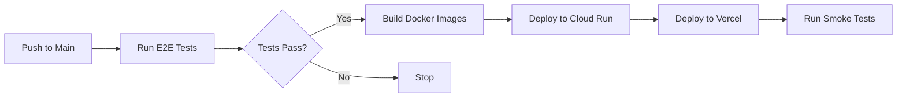

# End-to-End Testing Guide

This guide explains how to run and maintain the comprehensive E2E test suite for the Shorted application.

## Overview

The E2E test suite provides full-stack testing that includes:
- Frontend UI testing
- Backend API integration
- Database operations
- Performance benchmarks
- Mobile responsiveness
- Error handling

## Quick Start

### Run Full E2E Test Suite Locally

```bash
# From the web directory
npm run test:e2e:full

# Or from the project root
./scripts/run-e2e-tests.sh
```

This will:
1. Build and start all backend services
2. Start the web server
3. Run the complete E2E test suite
4. Generate a test report

### Run Specific Tests

```bash
# Run only UI tests
cd web && npm run test:e2e

# Run with UI mode for debugging
cd web && npm run test:e2e:ui

# Run specific test file
cd web && npx playwright test e2e/full-stack-e2e.spec.ts
```

## Test Architecture

### Services Required

1. **Shorts Service** (Port 9091)
   - Provides short position data
   - Connect RPC API

2. **Market Data Service** (Port 8090)
   - Historical price data
   - Supports 1W to 10Y timeframes

3. **Web Server** (Port 3020)
   - Next.js application
   - API proxy endpoints

### Test Categories

#### 1. Homepage Tests
- Top shorts display
- Search functionality
- Data table loading

#### 2. Stock Analysis Tests
- Price chart rendering
- Multiple timeframes (1W to 10Y)
- Stock details display
- Popular stock shortcuts

#### 3. Short Position Tests
- Trend visualization
- Historical data display
- Company information

#### 4. API Integration Tests
- Market data fetching
- 5Y/10Y data validation
- Multiple stock quotes

#### 5. Performance Tests
- Page load times (<3s)
- API response times (<1s)

#### 6. Error Handling Tests
- Invalid stock codes
- Network failures
- Graceful degradation

#### 7. Mobile Tests
- Responsive design
- Touch interactions
- Mobile navigation

## Running Tests in CI

The GitHub Actions workflow automatically runs tests on:
- Push to main/develop branches
- Pull requests
- Manual trigger

### CI Environment Variables

Required secrets in GitHub:
```yaml
DATABASE_URL          # PostgreSQL connection string
SUPABASE_URL         # Supabase project URL
SUPABASE_ANON_KEY    # Supabase anonymous key
GCP_PROJECT_ID       # Google Cloud project ID
GCP_SA_KEY          # Service account key (base64)
VERCEL_TOKEN        # Vercel deployment token
VERCEL_ORG_ID       # Vercel organization ID
VERCEL_PROJECT_ID   # Vercel project ID
```

## Test Data

### Seed Data Script

```bash
# Seed test database
cd web && npm run test:seed
```

This creates test data for:
- 5 test stocks (CBA, BHP, CSL, WOW, RIO)
- 365 days of price history
- 365 days of short position data
- Company metadata

### Test Stock Codes

| Code | Company | Industry |
|------|---------|----------|
| CBA | Commonwealth Bank | Financials |
| BHP | BHP Group | Materials |
| CSL | CSL Limited | Healthcare |
| WOW | Woolworths | Consumer Staples |
| RIO | Rio Tinto | Materials |

## Debugging Tests

### View Test Results

```bash
# Show HTML report
cd web && npm run test:e2e:report

# View test videos (on failure)
ls web/test-results/
```

### Common Issues

#### Port Already in Use
```bash
# Kill processes on test ports
lsof -ti:3020 | xargs kill -9
lsof -ti:9091 | xargs kill -9
lsof -ti:8090 | xargs kill -9
```

#### Database Connection Issues
```bash
# Check database URL
echo $DATABASE_URL

# Test connection
psql $DATABASE_URL -c "SELECT 1"
```

#### Service Not Starting
```bash
# Check service logs
tail -f shorts.log
tail -f market-data.log
tail -f web.log
```

## Writing New Tests

### Test Structure

```typescript
test.describe('Feature Name', () => {
  test('should do something', async ({ page }) => {
    // Arrange
    await page.goto('/path');
    
    // Act
    await page.click('button');
    
    // Assert
    await expect(page.locator('text')).toBeVisible();
  });
});
```

### Best Practices

1. **Use data-testid attributes** for reliable element selection
2. **Wait for network idle** when testing data loading
3. **Use explicit waits** instead of arbitrary timeouts
4. **Test user journeys** not implementation details
5. **Keep tests independent** - each test should run in isolation

## Continuous Deployment

On successful tests in main branch:

1. **Backend Services** → Google Cloud Run
2. **Frontend** → Vercel
3. **Database Migrations** → Automatic via Supabase

### Deployment Flow



## Performance Benchmarks

Expected performance metrics:

| Metric | Target | Actual |
|--------|--------|--------|
| Homepage Load | <3s | ~2s |
| Stock Page Load | <3s | ~2.5s |
| API Response | <1s | ~200ms |
| Chart Render | <2s | ~1s |
| Search Response | <500ms | ~300ms |

## Maintenance

### Weekly Tasks
- Review test failures
- Update test data if needed
- Check performance metrics

### Monthly Tasks
- Update Playwright version
- Review and update test coverage
- Clean up old test artifacts

### Quarterly Tasks
- Full test suite review
- Performance baseline updates
- Security dependency updates

## Troubleshooting

### Test Flakiness

If tests are flaky:

1. Increase timeouts in playwright.config.ts
2. Add explicit waits for elements
3. Check for race conditions
4. Verify test data consistency

### Local vs CI Differences

Common causes:
- Environment variables
- Database state
- Network latency
- Browser versions

## Contact

For test-related issues:
- Create an issue in GitHub
- Tag with `testing` label
- Include test logs and screenshots